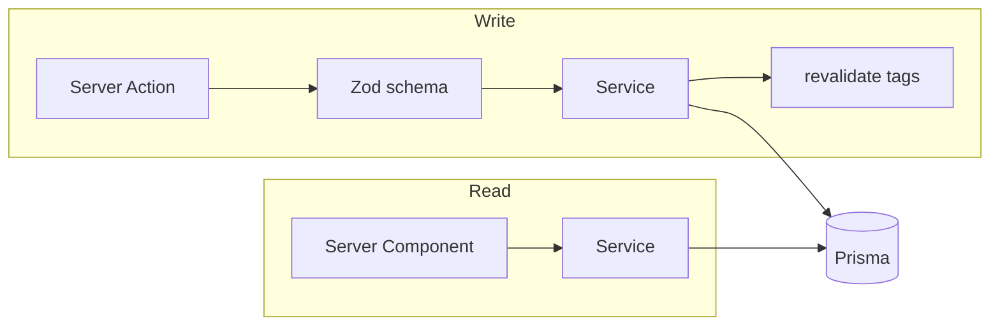
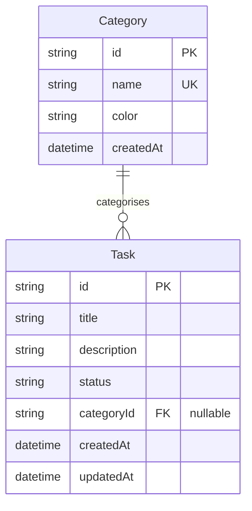

# Architecture

How this codebase is put together and why.
Read it once to find your way around;
come back to [`docs/guides/`](./docs/guides/README.md) for the how-to detail on any individual piece.

The split is deliberate: this document owns **shape and rationale**, the guides own **procedure**.
Anything the guides already explain is linked to here rather than restated, so there is only ever one copy to keep true.

> **This is Next.js 16 and Prisma 7.** Two conventions differ from most of what is written about them:
> the request-level interceptor is **Proxy**, not Middleware, and the Prisma client requires a **driver adapter** rather than carrying its own engine.
> See [`AGENTS.md`](./AGENTS.md).

---

## Directory structure

```text
app/                      Routes. Next.js App Router.
  (app)/                  Authenticated area — route group, not a URL segment
    tasks/                Task list, and the components used only by it
    categories/           Category management, likewise
  api/health/             Liveness endpoint for Docker and reverse proxies
  login/  logout/         Session entry and exit
src/
  components/             Components shared across more than one route
    ui/                   shadcn/ui primitives — we own this source
  lib/                    Framework-agnostic helpers
    dtos/                 Prisma model -> plain serialisable object
    schemas/              Zod input schemas
    session.ts            The session API
  server/                 Server-only. Never imported from a Client Component
    db.ts                 Prisma singleton and adapter selection
    services/             The data-access seam — all DB access lives here
    errors.ts             Domain error types
prisma/
  schema.prisma           One schema, both engines
  migrations/sqlite/      Two histories, because the SQL differs per engine
  migrations/postgres/
scripts/                  Build- and boot-time tooling (provider resolution)
test/                     Vitest unit and integration projects
docs/guides/              How-to guides for working on the code
```

Route-local components live beside their route (`app/(app)/tasks/task-card.tsx`);
they move to `src/components/` only once a second route needs them.
This keeps the shared surface small and makes it obvious what a route actually owns.

---

## The layers

Two paths reach the database, and both go through the same seam.



**Reads** happen in Server Components, which call a service directly and render the result.
There is no client-side fetching layer and no API surface in between.

**Writes** go through a Server Action, which validates its input, calls a service, and revalidates the affected cache tags.

### Why a service layer

`src/server/services/` is the only place Prisma is touched.
Nothing in `app/` imports the client directly.

That constraint buys three things.
A future REST or mobile API can call the same services without the logic being trapped inside a React-specific entry point — which is the seam this project most wants to keep open.
Validation has exactly one place it can be bypassed from, so "did this path check its input?" is answerable by reading one directory.
And the services return **DTOs**, not Prisma models, so `Date` objects are converted to ISO strings before they can cross the server/client boundary and fail to serialise.

→ [Database & service layer](./docs/guides/database.md) for adding a service.

### The action contract

Every Server Action returns an `ActionResult<T>` — a discriminated union of `{ ok: true, data }` or `{ ok: false, error, code?, fieldErrors? }`.
Actions do not throw at their callers.

Services _do_ throw, using the `DomainError` subclasses in `src/server/errors.ts` (`NotFoundError`, `ConflictError`).
`toActionError()` converts them at the action boundary:
a `DomainError` becomes a friendly message plus a machine-readable `code`, while anything unanticipated is logged and flattened to a generic message.
This is what stops an internal failure from leaking a stack trace or a database detail into the UI, and it is why the distinction between "expected domain outcome" and "bug" is expressed as a type rather than as a convention.

→ [Server Actions](./docs/guides/server-actions.md) · [Input validation](./docs/guides/validation.md)

---

## Auth model

Single admin user.
There is no user table — the password lives in `ADMIN_PASSWORD` and a valid session is the only state that exists.

Authentication is **two-tier**, and the distinction matters:

1. **The perimeter** — `proxy.ts` runs before every matched request, decrypts the session cookie, and redirects unauthenticated traffic to `/login`.
   It does no database work.
2. **The real guard** — every protected page calls `requireSession()` itself.

The perimeter is an optimisation, not the security boundary.
It is what makes an unauthenticated request cheap to reject, but a page that relied on it alone would be unprotected the moment a route stopped matching the proxy's matcher.
Treating it as the only check is the standard way this pattern goes wrong.

The session itself is an encrypted, `httpOnly` cookie via [iron-session](https://github.com/vvo/iron-session) — the payload is `{ isLoggedIn: true }` and nothing else.
`SESSION_SECRET` is the encryption key, which is why rotating it logs everyone out.

Three details in `app/login/actions.tsx` are deliberate and worth not undoing: the password comparison hashes both sides to equal length before `timingSafeEqual`, so neither the password nor its length leaks through timing;
the `?next=` redirect target is rejected unless it is a same-origin absolute path, closing an open-redirect vector;
and failed attempts are rate-limited in memory.

→ [Authentication & sessions](./docs/guides/authentication.md) · [Rate limiting](./docs/guides/rate-limiting.md)

---

## Data model



Deleting a category sets its tasks' `categoryId` to null rather than deleting them — losing a category should never lose work.

Two constraints on this schema come from supporting both engines.
Column types are restricted to `String`, `Int`, `DateTime` and `Boolean`: no `Json`/`Jsonb`, no native UUID.
And `status` is a `String` holding `"open" | "in_progress" | "closed"` rather than a database enum, with the union enforced in TypeScript and Zod instead.
Both are the price of one schema compiling to both providers.

---

## Running on two database engines

One image serves SQLite or Postgres, chosen from the shape of `DATABASE_URL`.
Three things have to agree for that to work:

| Piece             | Selected by                         | Where                          |
| ----------------- | ----------------------------------- | ------------------------------ |
| Schema provider   | rewritten before any Prisma command | `scripts/resolve-provider.mjs` |
| Migration history | `sqlite/` or `postgres/` directory  | `prisma.config.ts`             |
| Runtime adapter   | `PrismaBetterSqlite3` or `PrismaPg` | `src/server/db.ts`             |

All three read the URL through the same `detectProvider()` helper, so they cannot disagree about which engine is in play.

`prisma generate` bakes the provider into the client it emits, and that client is compiled into the bundle — so an image built the obvious way could only ever serve the engine it was built against.
The way out is to generate **both** clients at build time (`scripts/generate-clients.mjs` runs the generator twice, into `generated/prisma-sqlite/` and `generated/prisma-postgresql/`) and choose between them at runtime.
That is what `src/server/db.ts` does when it picks an adapter.

The schema's `provider` line is a separate problem, because Prisma cannot read it from an environment variable.
`scripts/resolve-provider.mjs` rewrites it at container start, before `prisma migrate deploy` runs, which is what selects the matching migration history.
This is why `prisma/` is the one directory the app user needs write access to.

→ [Dual-provider DB & migrations](./docs/guides/dual-provider-migrations.md)

---

## Caching

Reads are cached by tag and invalidated explicitly.
`src/lib/cache.ts` owns the tag vocabulary;
actions call `revalidateTasks()` / `revalidateCategories()` after a successful mutation.

Note that `revalidateCategories()` also invalidates the tasks tag.
Task cards render their category's name and colour, so a renamed category leaves stale task views behind unless both are dropped together.

---

## Configuration

The app **refuses to boot** without valid configuration rather than failing at the first request.
`instrumentation.ts` runs once per server instance and throws if `ADMIN_PASSWORD` is missing, or if `SESSION_SECRET` is missing or shorter than 32 characters.
`DATABASE_URL` is checked separately at module load in `src/server/db.ts`.

Failing at boot means a misconfigured container crash-loops visibly instead of serving a broken app.

→ [Environment & boot-time contract](./docs/guides/environment.md) · [configuration reference](./README.md#configuration)

---

## Packaging

A multi-stage build produces a standalone Next.js server on `node:24-alpine`, running as a non-root user, with the Prisma CLI installed into the image so the entrypoint can apply migrations before the server starts.
Data lives in `/app/data`.

Images are published to GHCR for `linux/amd64` and `linux/arm64`, and signed with cosign in keyless mode.

→ [`Dockerfile`](./Dockerfile) · [`.github/workflows/publish.yml`](./.github/workflows/publish.yml) · [self-hosting](./README.md#self-hosting)

---

## Testing

Vitest, split into two projects:
`unit` for pure logic and `integration` for tests that exercise services against a real in-memory SQLite database.
Both run on every pull request.

→ [Testing patterns](./docs/guides/testing.md)

---

## Decisions that would be expensive to reverse

- **Server Actions instead of a REST API.** The service layer is the hedge; the actions are a thin shell over it.
- **No user table.** Multi-user support means introducing identity everywhere at once, not adding a column.
- **Both database engines from day one.** Cheap to maintain now, and it constrains the schema;
  adding Postgres later would have meant a migration history that never existed.
- **Dark-only theming.** A light theme means auditing every colour token, not adding a toggle.

The reasoning behind the original stack choices is in [`docs/PLAN.md` §2](./docs/PLAN.md).
