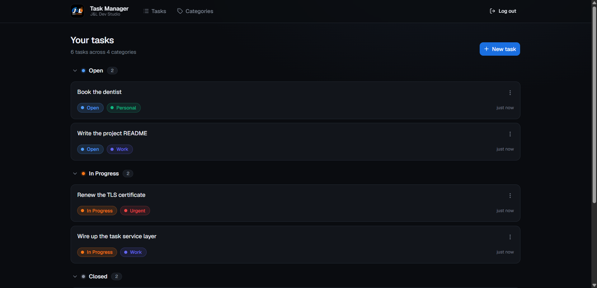
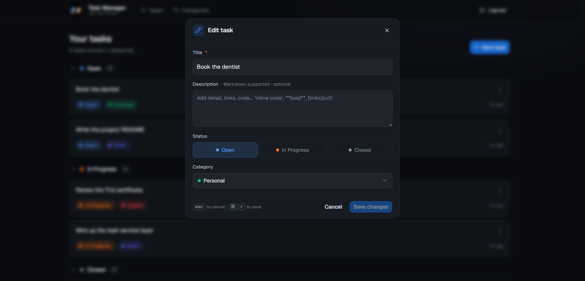
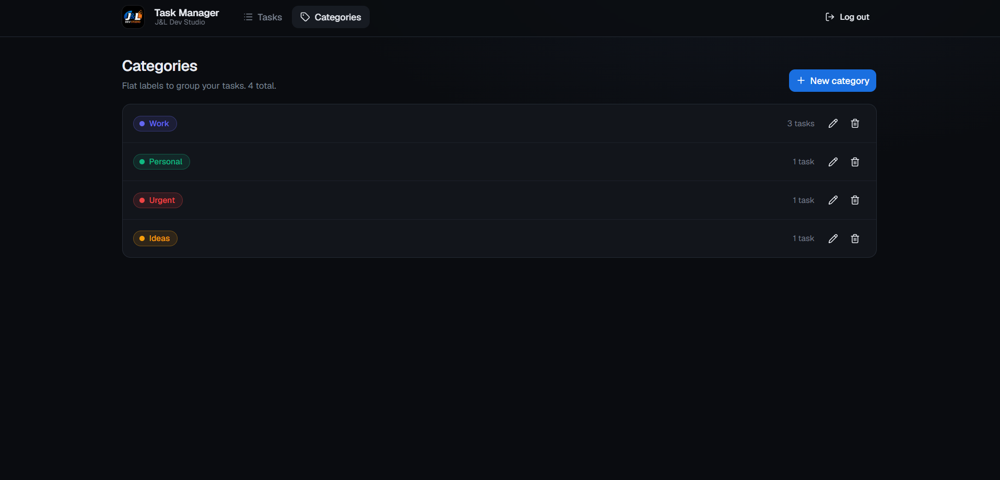
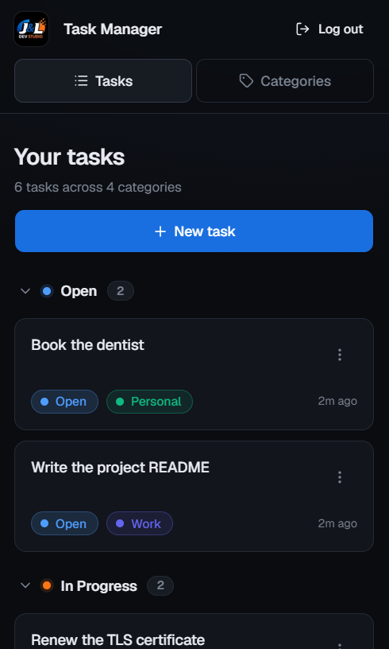

# J&L Task Management Solution

> A self-hosted, open-source task management web app — built for individuals who want to own their data.

**Status:** 🚧 In active development. MVP targeted for `v1.0.0`. See [`PLAN.md`](./docs/PLAN.md) for the full roadmap.



---

## Why this exists

Existing task tools fall into two camps: hosted SaaS products that own your data and lock features behind subscriptions, and self-hosted alternatives that are either over-engineered for one person or feel like clones of Trello and Jira.

This project aims for a third option:

- **Self-hosted by default.** Your data lives on hardware you control.
- **Single-user focused.** No team-collaboration tax — no permission models, no workspaces, no seats.
- **Lightweight to deploy.** One Docker container, one volume, one env file.
- **Yours to extend.** MIT-licensed; fork it, modify it, ignore upstream if you want.

---

## What it is (and isn't)

**It is:**

- A web app for managing personal tasks
- Designed for desktop, usable on mobile
- Built to be self-hosted via Docker
- Inspired by GitHub Issues, Trello, and Jira — but distinct from all three

**It isn't:**

- A team collaboration tool
- A hosted SaaS (a hosted version may exist later — separate product)
- A Trello/Jira clone — feature parity is not a goal
- Ready for production use yet (see status above)

For the full scope and what's deferred, see [`PLAN.md` § 3](./docs/PLAN.md).

---

## Screenshots

|                                                     |                                                      |
| --------------------------------------------------- | ---------------------------------------------------- |
|    |           |
| Quick capture — a title is the only required field. | Categories are flat, each with an assignable colour. |



---

## Self-hosting

> ⚠️ **Not yet released.** Published images begin at the first tagged release. Until then, the clone-and-build path below is the one that works.

Both paths need a `.env` file. Copy the template and fill in the two secrets:

```bash
cp .env.example .env
```

```bash
# Generate a session secret
openssl rand -hex 32
```

Then pick a path.

### Option 1 — Pre-built image

No clone required. Download the compose file and the env template next to each other:

```bash
curl -O https://raw.githubusercontent.com/J-L-Dev-Studio/Task-Management-Solution/production/docker-compose.prod.yml
curl -o .env https://raw.githubusercontent.com/J-L-Dev-Studio/Task-Management-Solution/production/.env.example
# edit .env — set ADMIN_PASSWORD and SESSION_SECRET

docker compose -f docker-compose.prod.yml up -d
```

The app is on <http://localhost:3000>. To pin a version instead of tracking `:latest`, set `TMS_VERSION=v1.0.0` in `.env`.

### Option 2 — Clone and build

```bash
git clone https://github.com/J-L-Dev-Studio/Task-Management-Solution.git
cd Task-Management-Solution
cp .env.example .env
# edit .env — set ADMIN_PASSWORD and SESSION_SECRET

docker compose up -d
```

Either way the container applies database migrations on start, so there is no separate setup step.

---

## Configuration

Every variable the app reads. Set them in `.env`, which both compose files load.

| Variable            | Required          | Default                 | Notes                                                                                 |
| ------------------- | ----------------- | ----------------------- | ------------------------------------------------------------------------------------- |
| `ADMIN_PASSWORD`    | **yes**           | —                       | The single admin password. The app refuses to start without it.                       |
| `SESSION_SECRET`    | **yes**           | —                       | **At least 32 characters.** Encrypts the session cookie. Changing it logs you out.    |
| `DATABASE_URL`      | **yes**           | `file:/app/data/app.db` | `file:` for SQLite, `postgresql://` for Postgres. The compose files set this for you. |
| `PORT`              | no                | `3000`                  | Host port published by the compose files; they pin the container to 3000.             |
| `TMS_VERSION`       | no                | `latest`                | Image tag to run. Pre-built image path only.                                          |
| `POSTGRES_PASSWORD` | if using Postgres | —                       | Password for the optional Postgres service in the compose files.                      |

### Using PostgreSQL instead of SQLite

SQLite is the default and needs nothing beyond the data volume. Both compose files carry a commented-out Postgres service — uncomment the three marked blocks and point `DATABASE_URL` at it. The same image serves either engine; it picks the driver and the migration history from the URL.

There is no conversion step between the two, so this is a decision to make before first run rather than a switch to flip later.

---

## Security

This app has one password and no user accounts. Three things are your responsibility as the deployer:

- **Set a real `ADMIN_PASSWORD`.** It is the only thing between the internet and your data. The app will not start without one, but it cannot tell a strong password from a weak one.
- **Generate `SESSION_SECRET` randomly** (`openssl rand -hex 32`). Reusing the example value from `.env.example` means anyone who has read this repository can forge a session cookie.
- **Terminate HTTPS yourself.** The container serves plain HTTP. Put a reverse proxy (Caddy, nginx, Traefik) in front of it before exposing it beyond your own network — otherwise the password and session cookie travel in the clear.

The session cookie is `httpOnly` and encrypted, and is marked `secure` when `NODE_ENV=production` (which the image sets), so it will only be sent over HTTPS in a deployed instance.

---

## Backup and restore

**SQLite (default).** Everything lives in the `app-data` volume. Compose prefixes volume names with the project name, which defaults to the directory you ran it from — `docker volume ls` shows the real name if yours differs from the one below.

On the pre-built image path the compose file is not named `docker-compose.yml`, so every `docker compose` command below needs `-f docker-compose.prod.yml`. Without it you get `no configuration file provided: not found`. Set it once for the session:

```bash
export COMPOSE_FILE=docker-compose.prod.yml   # pre-built image path only
```

Stop the stack first so no write is in flight:

```bash
docker compose stop
docker run --rm -v task-management-solution_app-data:/data -v "$PWD":/backup \
  alpine tar czf /backup/taskmanager-backup.tar.gz -C /data .
docker compose start
```

Restore by reversing it into an empty volume:

```bash
docker compose down
docker run --rm -v task-management-solution_app-data:/data -v "$PWD":/backup \
  alpine sh -c "rm -rf /data/* && tar xzf /backup/taskmanager-backup.tar.gz -C /data"
docker compose up -d
```

**Postgres.** Dump the database out of the running `db` service:

```bash
docker compose exec -T db pg_dump -U postgres -d taskmanager > taskmanager-backup.sql
```

Restore it into an empty database the same way round:

```bash
docker compose exec -T db psql -U postgres -d taskmanager < taskmanager-backup.sql
```

Whichever engine you use, test a restore at least once. An untested backup is a hypothesis.

---

## Upgrading

If you pinned `TMS_VERSION` in `.env`, edit it to the version you are moving to first. Pulling without changing it re-fetches the version you are already on: the commands below then report `Pulled` and `Started` and leave you where you were, with nothing to indicate the upgrade did not happen.

```bash
docker compose -f docker-compose.prod.yml pull
docker compose -f docker-compose.prod.yml up -d
```

The container applies any new migrations on start, so no extra step is needed. **Back up first** — migrations are one-way, and downgrading to a previous image after one has run is not supported.

Tags behave as follows:

| Tag         | Moves                              | Use it if                                         |
| ----------- | ---------------------------------- | ------------------------------------------------- |
| `:latest`   | on each non-prerelease release     | you want the newest stable version                |
| `:v1.0.0`   | never — a version tag is immutable | you want to control exactly when you upgrade      |
| `:unstable` | on every push to `develop`         | you are testing unreleased work, not self-hosting |

---

## Health and logs

`GET /api/health` returns `200 {"status":"ok"}` when the server is up. The image already uses it for its Docker `HEALTHCHECK`, so `docker compose ps` reports `healthy` — point your reverse proxy or uptime monitor at the same endpoint.

Logs go to stdout, which is where Docker expects them:

```bash
docker compose logs -f
```

Start-up logs show provider resolution and each migration applied, which is the first place to look if a container will not come up.

---

## Tech stack

| Layer        | Choice                                                                                       |
| ------------ | -------------------------------------------------------------------------------------------- |
| Framework    | Next.js (App Router) + TypeScript                                                            |
| Styling      | Tailwind CSS + [shadcn/ui](https://ui.shadcn.com/)                                           |
| ORM          | [Prisma](https://www.prisma.io/)                                                             |
| Database     | SQLite (default) / Postgres (opt-in)                                                         |
| Auth         | Single admin user via env-var password ([iron-session](https://github.com/vvo/iron-session)) |
| Distribution | Docker image on GitHub Container Registry                                                    |

For the reasoning behind each choice, see [`PLAN.md` § 2](./docs/PLAN.md).

---

## Documentation

- [`ARCHITECTURE.md`](./ARCHITECTURE.md) — how the codebase is put together and why
- [`CHANGELOG.md`](./CHANGELOG.md) — what changed in each release
- [`PLAN.md`](./docs/PLAN.md) — full project plan, phased delivery, definition of done
- [Developer guides](./docs/guides/README.md) — integration how-tos (auth, database, migrations, environment, rate limiting, testing)
- [`CONTRIBUTING.md`](./CONTRIBUTING.md) — local development setup, branching

---

## Design principles

The original sketch for this project listed three goals; they've been refined into the principles below, which guide design decisions throughout development:

- **Capture should be fast.** Adding a new task should take fewer clicks and less time than any existing tool the maintainers use day to day.
- **Be accessible.** The app should be usable on whatever device you reach for first — desktop or mobile.
- **Don't get in the way.** No required fields beyond a title. Categories, descriptions, and metadata are optional. The tool should adapt to how you work, not impose process.

---

## Roadmap

The full phased plan lives in [`PLAN.md`](./docs/PLAN.md). At a glance:

- [ ] **v1.0.0 (MVP)** — core CRUD, single-admin auth, Docker distribution
- [ ] **v1.1+** — search, filter, sort; due dates; sub-categories; dependencies
- [ ] **v2.0** — drag-and-drop kanban view; rich Markdown editor

Major features are tracked as GitHub Issues with the `roadmap` label.

---

## Contributing

Bug reports and feature requests are welcome via [GitHub Issues](https://github.com/J-L-Dev-Studio/Task-Management-Solution/issues/new/choose). This project is maintained by a two-person studio and is not actively seeking external code contributions.

See [`CONTRIBUTING.md`](./CONTRIBUTING.md) for local setup and details.

---

## License

MIT — see [`LICENSE`](./LICENSE).

This means you can self-host, modify, and redistribute this software freely. **No warranty is provided.** As with any self-hosted software, you are responsible for the security and operation of your own instance.

---

## Acknowledgements

Built by **J&L Dev Studio**, a two-person studio exploring open-source tooling.

Influenced by [GitHub Issues](https://github.com/features/issues), [Trello](https://trello.com/), [Linear](https://linear.app/), and the broader self-hosted software community ([r/selfhosted](https://www.reddit.com/r/selfhosted/), [awesome-selfhosted](https://github.com/awesome-selfhosted/awesome-selfhosted)).
